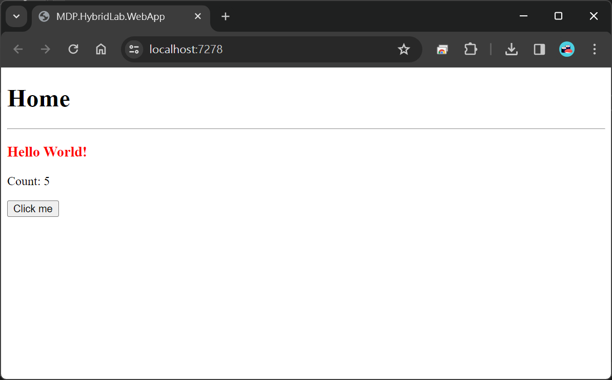
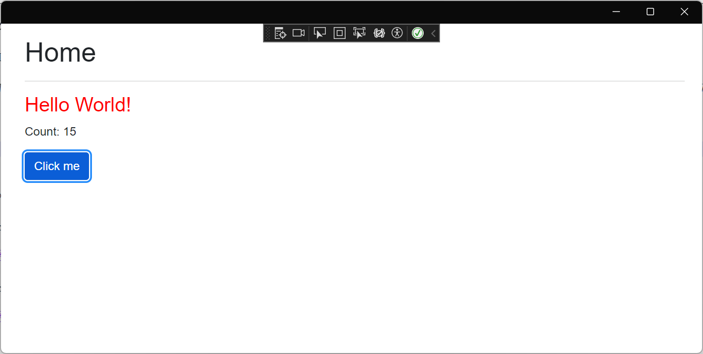
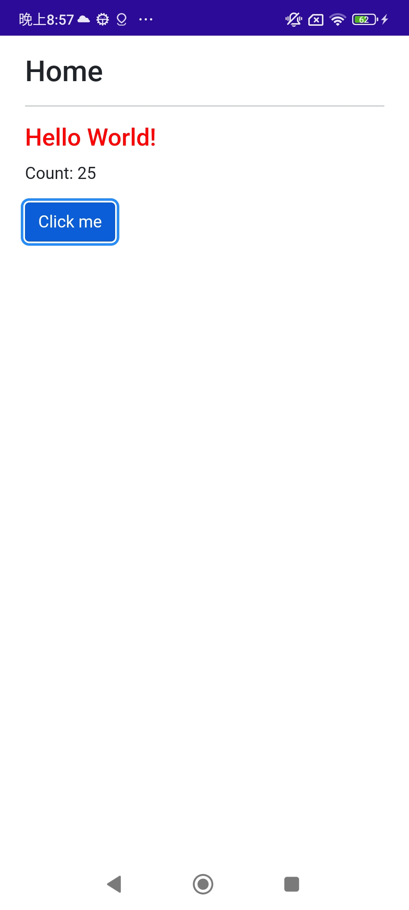

# MDP.HybridLab

MDP.HybridLab 示範如何使用Blazor元件，開發系統畫面。並且滿足一份程式碼，執行在多平台的技術目標。平台列表：Web、APP(iOS+Android)、Desktop(MAC+Windows)。

## 專案架構

- MDP.HybridLab: 邏輯層範例，提供注入使用。

- MDP.HybridLab.Components: 展示層範例，使用Blazor元件建立的系統畫面。

- MDP.HybridLab.HybridApp: MAUI Blazor 應用程式，做為Blazor平台，使用Hybrid模式將Blazor元件執行在APP(iOS+Android)、Desktop(MAC+Windows)。

- MDP.HybridLab.WebApp: ASP.NET Core 應用程式，做為Blazor平台，使用SSR+SignalR模式將Blazor元件執行在Web瀏覽器。

## 執行結果

- Web執行結果

- Windows執行結果

- Android執行結果

